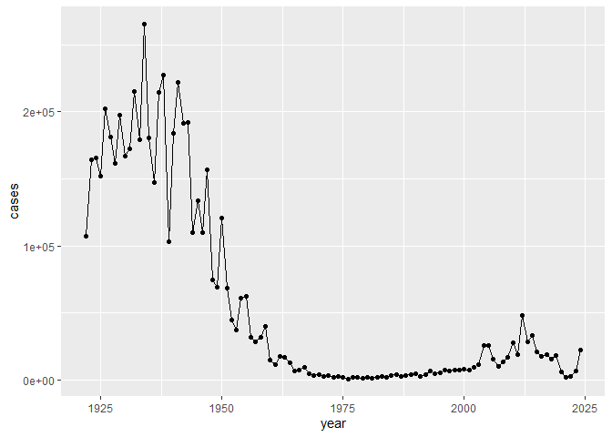
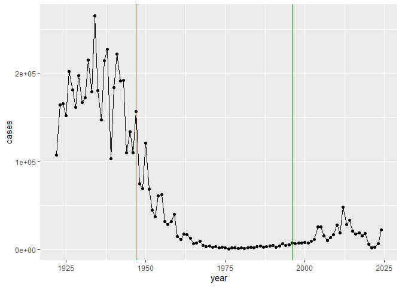
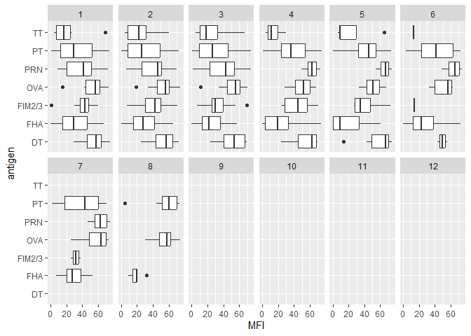
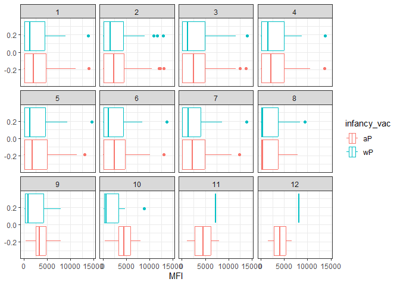
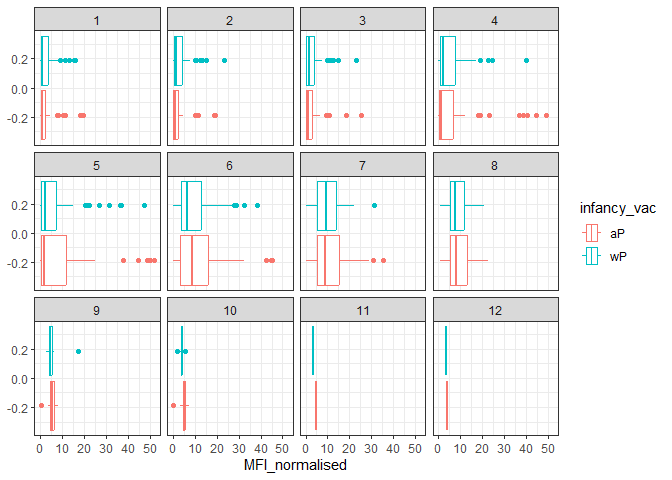

# Class 19 Mini Project
Suraj Sidhu: A18512793

- [Background](#background)
- [The CMI-PB API returns JSON data](#the-cmi-pb-api-returns-json-data)
- [Examine IgG Ab titer levels](#examine-igg-ab-titer-levels)
- [Obtaining CMI-PB RNASeq data](#obtaining-cmi-pb-rnaseq-data)

## Background

Pertussis is a bacterial lung infection aksi knwn as Whooping Cough.
Let’s begin by examining case numbers in the US.

``` r
cdc <- data.frame(
                                 year = c(1922L,1923L,1924L,1925L,
                                          1926L,1927L,1928L,1929L,1930L,1931L,
                                          1932L,1933L,1934L,1935L,1936L,
                                          1937L,1938L,1939L,1940L,1941L,1942L,
                                          1943L,1944L,1945L,1946L,1947L,
                                          1948L,1949L,1950L,1951L,1952L,
                                          1953L,1954L,1955L,1956L,1957L,1958L,
                                          1959L,1960L,1961L,1962L,1963L,
                                          1964L,1965L,1966L,1967L,1968L,1969L,
                                          1970L,1971L,1972L,1973L,1974L,
                                          1975L,1976L,1977L,1978L,1979L,1980L,
                                          1981L,1982L,1983L,1984L,1985L,
                                          1986L,1987L,1988L,1989L,1990L,
                                          1991L,1992L,1993L,1994L,1995L,1996L,
                                          1997L,1998L,1999L,2000L,2001L,
                                          2002L,2003L,2004L,2005L,2006L,2007L,
                                          2008L,2009L,2010L,2011L,2012L,
                                          2013L,2014L,2015L,2016L,2017L,2018L,
                                          2019L,2020L,2021L,2022L,2023L, 2024L),
                                 
         cases = c(107473,164191,165418,152003,
                                          202210,181411,161799,197371,
                                          166914,172559,215343,179135,265269,
                                          180518,147237,214652,227319,103188,
                                          183866,222202,191383,191890,109873,
                                          133792,109860,156517,74715,69479,
                                          120718,68687,45030,37129,60886,
                                          62786,31732,28295,32148,40005,
                                          14809,11468,17749,17135,13005,6799,
                                          7717,9718,4810,3285,4249,3036,
                                          3287,1759,2402,1738,1010,2177,2063,
                                          1623,1730,1248,1895,2463,2276,
                                          3589,4195,2823,3450,4157,4570,
                                          2719,4083,6586,4617,5137,7796,6564,
                                          7405,7298,7867,7580,9771,11647,
                                          25827,25616,15632,10454,13278,
                                          16858,27550,18719,48277,28639,32971,
                                          20762,17972,18975,15609,18617,
                                          6124,2116,3044,7063,22538)
       )
```

> Q1. With the help of the R “addin” package datapasta assign the CDC
> pertussis case number data to a data frame called cdc and use ggplot
> to make a plot of cases numbers over time.

Plot your cases per year

``` r
library(ggplot2)

ggplot(cdc) +
  aes(year,cases) +
    geom_point() +
  geom_point() +
  geom_line()
```



> Q2. Using the ggplot geom_vline() function add lines to your previous
> plot for the 1946 introduction of the wP vaccine and the 1996 switch
> to aP vaccine (see example in the hint below). What do you notice?

Add some major milestone time points to our plot:

``` r
ggplot(cdc) +
  aes(year,cases) +
    geom_point() +
  geom_point() +
  geom_line() +
  geom_vline(xintercept = 1947, col = "red")+
  geom_vline(xintercept = 1996, col = "forestgreen")
```



> Q3. Describe what happened after the introduction of the aP vaccine?
> Do you have a possible explanation for the observed trend?

The introduction of mandatory wP (whole-cell) Pertussis immunization in
a the mid 1940s lead to a dramatic reduction in case numbers (from over
200,000 to 100s). After the introduction of the acellular pertussis (aP)
vaccine in the 1990s, reported pertussis cases in the United States
began to rise again after several decades of relatively low incidence
under the whole-cell pertussis (wP) vaccine.

## The CMI-PB API returns JSON data

The mission of CMI-PB is to provide the scientific community with a
comprehensive, high-quality and freely accessible resource of Pertussis
booster vaccination. https://www.cmi-pb.org/

They make the data available via JSON format API endpoints - basically
the database tables in a key: value type format like “infancy_vac”:“wP”.
To read this we can use `read_json()` function from the **jsonlite**
package. Install with install.packages(“jsonlite”)

``` r
library(jsonlite)
```

    Warning: package 'jsonlite' was built under R version 4.5.2

``` r
subject <- read_json("https://www.cmi-pb.org/api/subject", simplifyVector = TRUE) 

head(subject)
```

      subject_id infancy_vac biological_sex              ethnicity  race
    1          1          wP         Female Not Hispanic or Latino White
    2          2          wP         Female Not Hispanic or Latino White
    3          3          wP         Female                Unknown White
    4          4          wP           Male Not Hispanic or Latino Asian
    5          5          wP           Male Not Hispanic or Latino Asian
    6          6          wP         Female Not Hispanic or Latino White
      year_of_birth date_of_boost      dataset
    1    1986-01-01    2016-09-12 2020_dataset
    2    1968-01-01    2019-01-28 2020_dataset
    3    1983-01-01    2016-10-10 2020_dataset
    4    1988-01-01    2016-08-29 2020_dataset
    5    1991-01-01    2016-08-29 2020_dataset
    6    1988-01-01    2016-10-10 2020_dataset

Number of subjects

``` r
nrow(subject)
```

    [1] 172

> Q4. How many aP and wP infancy vaccinated subjects are in the dataset?

``` r
table(subject$infancy_vac)
```


    aP wP 
    87 85 

> Q5. How many Male and Female subjects/patients are in the dataset?

``` r
table(subject$biological_sex)
```


    Female   Male 
       112     60 

> Q6. What is the breakdown of race and biological sex (e.g. number of
> Asian females, White males etc…)?

``` r
table(subject$race, subject$biological_sex)
```

                                               
                                                Female Male
      American Indian/Alaska Native                  0    1
      Asian                                         32   12
      Black or African American                      2    3
      More Than One Race                            15    4
      Native Hawaiian or Other Pacific Islander      1    1
      Unknown or Not Reported                       14    7
      White                                         48   32

The breakdown is not representative of the US population - this is a
serious caveat for this study. However, it is still the largest sample
of it’s type ever assembled.

``` r
specimen <- read_json("http://cmi-pb.org/api/v5_1/specimen", simplifyVector = TRUE) 

ab_titter <- read_json("http://cmi-pb.org/api/v5_1/plasma_ab_titer", simplifyVector = TRUE) 
```

We need to join or link these tables with `subject` table so we can
begin to analyze this data and know who to give an AB sample was
collected for and when

> Q7. Using this approach determine (i) the average age of wP
> individuals, (ii) the average age of aP individuals; and (iii) are
> they significantly different?

``` r
library(lubridate)
```


    Attaching package: 'lubridate'

    The following objects are masked from 'package:base':

        date, intersect, setdiff, union

``` r
subject$age <- today() - ymd(subject$year_of_birth)
```

``` r
library(dplyr)
```


    Attaching package: 'dplyr'

    The following objects are masked from 'package:stats':

        filter, lag

    The following objects are masked from 'package:base':

        intersect, setdiff, setequal, union

``` r
ap <- subject %>% filter(infancy_vac == "aP")

round( summary( time_length( ap$age, "years" ) ) )
```

       Min. 1st Qu.  Median    Mean 3rd Qu.    Max. 
         23      27      28      28      29      35 

``` r
wp <- subject %>% filter(infancy_vac == "wP")
round(summary(time_length(wp$age, "years")))
```

       Min. 1st Qu.  Median    Mean 3rd Qu.    Max. 
         23      33      35      37      40      58 

Yes. These age distributions do not overlap much (aP ~20s, wP ~30s–50s).

> Q8. Determine the age of all individuals at time of boost?

``` r
int <- ymd(subject$date_of_boost) - ymd(subject$year_of_birth)
age_at_boost <- time_length(int, "year")
head(age_at_boost)
```

    [1] 30.69678 51.07461 33.77413 28.65982 25.65914 28.77481

> Q9a. With the help of a faceted boxplot or histogram (see below), do
> you think these two groups are significantly different?

``` r
x <- t.test(time_length( wp$age, "years" ),
       time_length( ap$age, "years" ))

x$p.value
```

    [1] 2.372101e-23

Yes there is a clear statistical difference

> Q9b. Complete the code to join specimen and subject tables to make a
> new merged data frame containing all specimen records along with their
> associated subject details:

``` r
meta <- inner_join(subject, specimen)
```

    Joining with `by = join_by(subject_id)`

``` r
head(meta)
```

      subject_id infancy_vac biological_sex              ethnicity  race
    1          1          wP         Female Not Hispanic or Latino White
    2          1          wP         Female Not Hispanic or Latino White
    3          1          wP         Female Not Hispanic or Latino White
    4          1          wP         Female Not Hispanic or Latino White
    5          1          wP         Female Not Hispanic or Latino White
    6          1          wP         Female Not Hispanic or Latino White
      year_of_birth date_of_boost      dataset        age specimen_id
    1    1986-01-01    2016-09-12 2020_dataset 14582 days           1
    2    1986-01-01    2016-09-12 2020_dataset 14582 days           2
    3    1986-01-01    2016-09-12 2020_dataset 14582 days           3
    4    1986-01-01    2016-09-12 2020_dataset 14582 days           4
    5    1986-01-01    2016-09-12 2020_dataset 14582 days           5
    6    1986-01-01    2016-09-12 2020_dataset 14582 days           6
      actual_day_relative_to_boost planned_day_relative_to_boost specimen_type
    1                           -3                             0         Blood
    2                            1                             1         Blood
    3                            3                             3         Blood
    4                            7                             7         Blood
    5                           11                            14         Blood
    6                           32                            30         Blood
      visit
    1     1
    2     2
    3     3
    4     4
    5     5
    6     6

> Q10. Now using the same procedure join meta with titer data so we can
> further analyze this data in terms of time of visit aP/wP, male/female
> etc.

``` r
ab_data <- inner_join(ab_titter, meta)
```

    Joining with `by = join_by(specimen_id)`

``` r
head(ab_data)
```

      specimen_id isotype is_antigen_specific antigen        MFI MFI_normalised
    1           1     IgE               FALSE   Total 1110.21154       2.493425
    2           1     IgE               FALSE   Total 2708.91616       2.493425
    3           1     IgG                TRUE      PT   68.56614       3.736992
    4           1     IgG                TRUE     PRN  332.12718       2.602350
    5           1     IgG                TRUE     FHA 1887.12263      34.050956
    6           1     IgE                TRUE     ACT    0.10000       1.000000
       unit lower_limit_of_detection subject_id infancy_vac biological_sex
    1 UG/ML                 2.096133          1          wP         Female
    2 IU/ML                29.170000          1          wP         Female
    3 IU/ML                 0.530000          1          wP         Female
    4 IU/ML                 6.205949          1          wP         Female
    5 IU/ML                 4.679535          1          wP         Female
    6 IU/ML                 2.816431          1          wP         Female
                   ethnicity  race year_of_birth date_of_boost      dataset
    1 Not Hispanic or Latino White    1986-01-01    2016-09-12 2020_dataset
    2 Not Hispanic or Latino White    1986-01-01    2016-09-12 2020_dataset
    3 Not Hispanic or Latino White    1986-01-01    2016-09-12 2020_dataset
    4 Not Hispanic or Latino White    1986-01-01    2016-09-12 2020_dataset
    5 Not Hispanic or Latino White    1986-01-01    2016-09-12 2020_dataset
    6 Not Hispanic or Latino White    1986-01-01    2016-09-12 2020_dataset
             age actual_day_relative_to_boost planned_day_relative_to_boost
    1 14582 days                           -3                             0
    2 14582 days                           -3                             0
    3 14582 days                           -3                             0
    4 14582 days                           -3                             0
    5 14582 days                           -3                             0
    6 14582 days                           -3                             0
      specimen_type visit
    1         Blood     1
    2         Blood     1
    3         Blood     1
    4         Blood     1
    5         Blood     1
    6         Blood     1

> Q11. How many specimens (i.e. entries in abdata) do we have for each
> isotype?

``` r
table(ab_data$isotype)
```


      IgE   IgG  IgG1  IgG2  IgG3  IgG4 
     6698  7265 11993 12000 12000 12000 

> Q12. What are the different \$dataset values in abdata and what do you
> notice about the number of rows for the most “recent” dataset?

``` r
table(ab_data$dataset)
```


    2020_dataset 2021_dataset 2022_dataset 2023_dataset 
           31520         8085         7301        15050 

## Examine IgG Ab titer levels

``` r
igg <- ab_data %>% filter(isotype == "IgG")
head(igg)
```

      specimen_id isotype is_antigen_specific antigen        MFI MFI_normalised
    1           1     IgG                TRUE      PT   68.56614       3.736992
    2           1     IgG                TRUE     PRN  332.12718       2.602350
    3           1     IgG                TRUE     FHA 1887.12263      34.050956
    4          19     IgG                TRUE      PT   20.11607       1.096366
    5          19     IgG                TRUE     PRN  976.67419       7.652635
    6          19     IgG                TRUE     FHA   60.76626       1.096457
       unit lower_limit_of_detection subject_id infancy_vac biological_sex
    1 IU/ML                 0.530000          1          wP         Female
    2 IU/ML                 6.205949          1          wP         Female
    3 IU/ML                 4.679535          1          wP         Female
    4 IU/ML                 0.530000          3          wP         Female
    5 IU/ML                 6.205949          3          wP         Female
    6 IU/ML                 4.679535          3          wP         Female
                   ethnicity  race year_of_birth date_of_boost      dataset
    1 Not Hispanic or Latino White    1986-01-01    2016-09-12 2020_dataset
    2 Not Hispanic or Latino White    1986-01-01    2016-09-12 2020_dataset
    3 Not Hispanic or Latino White    1986-01-01    2016-09-12 2020_dataset
    4                Unknown White    1983-01-01    2016-10-10 2020_dataset
    5                Unknown White    1983-01-01    2016-10-10 2020_dataset
    6                Unknown White    1983-01-01    2016-10-10 2020_dataset
             age actual_day_relative_to_boost planned_day_relative_to_boost
    1 14582 days                           -3                             0
    2 14582 days                           -3                             0
    3 14582 days                           -3                             0
    4 15678 days                           -3                             0
    5 15678 days                           -3                             0
    6 15678 days                           -3                             0
      specimen_type visit
    1         Blood     1
    2         Blood     1
    3         Blood     1
    4         Blood     1
    5         Blood     1
    6         Blood     1

> Q13. Complete the following code to make a summary boxplot of Ab titer
> levels (MFI) for all antigens:

``` r
ggplot(igg) +
  aes(MFI, antigen) +
  geom_boxplot() +
  xlim(0, 75) +
  facet_wrap(vars(visit), nrow = 2)
```

    Warning: Removed 6157 rows containing non-finite outside the scale range
    (`stat_boxplot()`).



> Q14. What antigens show differences in the level of IgG antibody
> titers recognizing them over time? Why these and not others?

The antigens PT, PRN, and FHA show clear changes in IgG titers over
time. These antigens are included in the acellular pertussis (aP)
vaccine therefore the antibody levels against them rise sharply after
the booster and then decline over the following visits.

``` r
ggplot(igg) +
  aes(MFI_normalised, antigen, col=infancy_vac ) +
  geom_boxplot(show.legend = FALSE) + 
  facet_wrap(vars(visit), nrow=2) +
  xlim(0,75) +
  theme_bw()
```

    Warning: Removed 5 rows containing non-finite outside the scale range
    (`stat_boxplot()`).


> Q15. Filter to pull out only two specific antigens for analysis and
> create a boxplot for each. You can chose any you like. Below I picked
> a “control” antigen (“OVA”, that is not in our vaccines) and a clear
> antigen of interest (“PT”, Pertussis Toxin, one of the key virulence
> factors produced by the bacterium B. pertussis).

For OVA

``` r
filter(igg, antigen=="OVA") %>%
  ggplot() +
  aes(MFI, col=infancy_vac) +
  geom_boxplot(show.legend = TRUE) +
  facet_wrap(vars(visit)) +
  theme_bw()
```



For FIM2/3

``` r
filter(igg, antigen=="FIM2/3") %>%
  ggplot() +
  aes(MFI_normalised, col=infancy_vac) +
  geom_boxplot(show.legend = TRUE) +
  facet_wrap(vars(visit)) +
  theme_bw()
```



> Q16. What do you notice about these two antigens time courses and the
> PT data in particular?

For the OVA antibody levels are flat across all visits and for the
FIM2/3 the antibody levels rise after boost, peak at day 14 then
gradually declines

> Q17. Do you see any clear difference in aP vs. wP responses?

Subjects primed with aP tended to have higher or faster IgG responses to
booster for PT and other vaccine antigens compared to wP-primed subjects
in some datasets.

2021 Dataset IgG levels time course

``` r
abdata.21 <- ab_data %>% filter(dataset == "2021_dataset")

abdata.21 %>% 
  filter(isotype == "IgG",  antigen == "PT") %>%
  ggplot() +
    aes(x=planned_day_relative_to_boost,
        y=MFI_normalised,
        col=infancy_vac,
        group=subject_id) +
    geom_point() +
    geom_line() +
    geom_vline(xintercept=0, linetype="dashed") +
    geom_vline(xintercept=14, linetype="dashed") +
  labs(title="2021 dataset IgG PT",
       subtitle = "Dashed lines indicate day 0 (pre-boost) and 14 (apparent peak levels)")
```


> Q18. Does this trend look similar for the 2020 dataset?

The time course trend are similar for both. Minor differences may exist
due to cohort age or sample size but the overall IgG dynamics for PT are
consistent between 2020 and 2021 datasets.

## Obtaining CMI-PB RNASeq data

Let’s read available RNA-Seq data for this gene into R and investigate
the time course of it’s gene expression values.

``` r
url <- "https://www.cmi-pb.org/api/v2/rnaseq?versioned_ensembl_gene_id=eq.ENSG00000211896.7"

rna <- read_json(url, simplifyVector = TRUE) 
```

To facilitate further analysis we need to “join” the rna expression data
with our metadata meta

``` r
ssrna <- inner_join(rna, meta)
```

    Joining with `by = join_by(specimen_id)`

> Q19. Make a plot of the time course of gene expression for IGHG1 gene
> (i.e. a plot of visit vs. tpm).

``` r
ggplot(ssrna) +
  aes(x = visit, y = tpm, group = subject_id) +
  geom_point() +
  geom_line(alpha = 0.2)
```


> Q20.: What do you notice about the expression of this gene (i.e. when
> is it at it’s maximum level)?

IGHG1 expression is low at baseline and rises after the booster,
reaching its maximum around the early post-boost visits. This reflects
activation of B cells and increased transcription of IgG1 mRNA following
antigen exposure.

> Q21. Does this pattern in time match the trend of antibody titer data?
> If not, why not?

The RNA expression peaks earlier than serum antibody titers, which rise
more slowly and reach maximum levels later. This difference occurs
because transcription occurs rapidly in activated B cells, but it takes
time for the translated IgG protein to accumulate in the blood.
