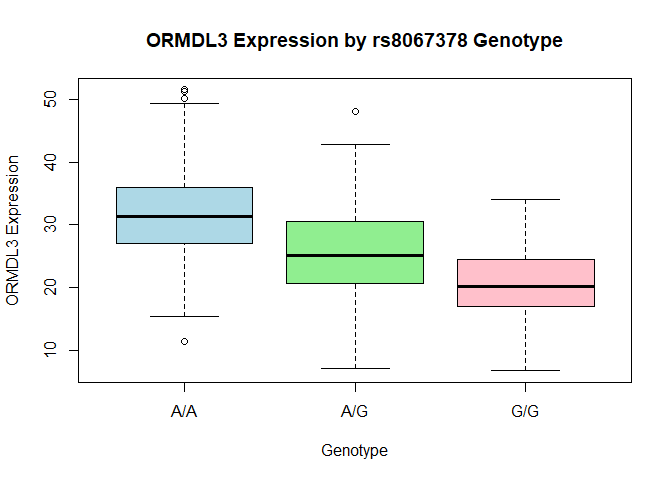

# Class 17 final
Suraj Sidhu: A18512793

Q13: Read this file into R and determine the sample size for each
genotype and their corresponding median expression levels for each of
these genotypes.

``` r
# Read the tab-delimited file
data <- read.table("rs8067378_ENSG00000172057.6.txt", header = TRUE)

# Check the first few rows
head(data)
```

       sample geno      exp
    1 HG00367  A/G 28.96038
    2 NA20768  A/G 20.24449
    3 HG00361  A/A 31.32628
    4 HG00135  A/A 34.11169
    5 NA18870  G/G 18.25141
    6 NA11993  A/A 32.89721

``` r
str(data)
```

    'data.frame':   462 obs. of  3 variables:
     $ sample: chr  "HG00367" "NA20768" "HG00361" "HG00135" ...
     $ geno  : chr  "A/G" "A/G" "A/A" "A/A" ...
     $ exp   : num  29 20.2 31.3 34.1 18.3 ...

``` r
summary(data)
```

        sample              geno                exp        
     Length:462         Length:462         Min.   : 6.675  
     Class :character   Class :character   1st Qu.:20.004  
     Mode  :character   Mode  :character   Median :25.116  
                                           Mean   :25.640  
                                           3rd Qu.:30.779  
                                           Max.   :51.518  

``` r
table(data$geno)
```


    A/A A/G G/G 
    108 233 121 

``` r
tapply(data$exp, data$geno, median)
```

         A/A      A/G      G/G 
    31.24847 25.06486 20.07363 

``` r
library(dplyr)
```


    Attaching package: 'dplyr'

    The following objects are masked from 'package:stats':

        filter, lag

    The following objects are masked from 'package:base':

        intersect, setdiff, setequal, union

``` r
data %>%
  group_by(geno) %>%
  summarise(
    n = n(),
    median_expression = median(exp)
  )
```

    # A tibble: 3 × 3
      geno      n median_expression
      <chr> <int>             <dbl>
    1 A/A     108              31.2
    2 A/G     233              25.1
    3 G/G     121              20.1

Q14: Generate a boxplot with a box per genotype, what could you infer
from the relative expression value between A/A and G/G displayed in this
plot? Does the SNP effect the expression of ORMDL3?

``` r
boxplot(exp ~ geno, data = data,
        main = "ORMDL3 Expression by rs8067378 Genotype",
        xlab = "Genotype",
        ylab = "ORMDL3 Expression",
        col = c("lightblue", "lightgreen", "pink"))
```



The boxplot shows that median ORMDL3 expression varies among genotypes.
The G/G genotype exhibits higher median expression compared to the A/A
genotype, indicating that the rs8067378 SNP is associated with
differences in ORMDL3 expression, with the G allele linked to increased
expression.
